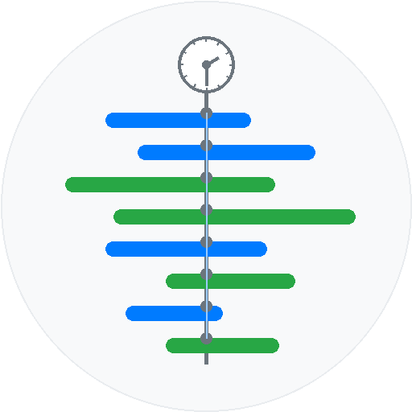

# VOD Synchronizer

<table align="center">
  <tr>
    <td style="">
      
    </td>
    <td style="">
      
SOOP VOD(다시보기) 시청 시 생방송 보듯이 다른 스트리머의 시점이나 채팅이 궁금할때 다른 스트리머의 VOD를 찾아서 볼 수 있게 해주는 크롬 확장 프로그램입니다.

    </td>
  </tr>
</table>

[주요 기능](#주요-기능) • [설치 방법](#설치-방법) • [사용 예시](#사용-예시) • [지원 플랫폼](#지원-플랫폼) • [동작 원리](#동작-원리) • [QnA](#qna) • [알려진 문제](#알려진-문제) • [업데이트 내역](#업데이트-내역) • [라이선스](#라이선스)

## 주요 기능

### SOOP Full 영상 다시보기 페이지에서 동작합니다.
- 우측 하단에 영상재생시점기준 당시의 시간을 보여줍니다. 
- 이 시간을 바꿔 입력하면 그 시간에 맞게 VOD의 재생시점을 바꿔서 **새로고침**합니다.
- SOOP 검색창에 스트리머를 검색하면 검색결과에 Find VOD 버튼이 생기고 버튼을 누르면 해당 스트리머의 VOD에서 현재 재생 시점과 동일한 시점의 VOD를 찾아 새 탭에서 열어줍니다. (최초 실행 시 팝업 허용이 필요할 수 있습니다.)

### CHZZK 다시보기 페이지에서도 동작합니다.
- 우측 하단에 영상재생시점기준 당시의 시간을 보여줍니다.
- 이 시간을 바꿔 입력하면 그 시간에 맞게 VOD의 재생시점을 바꿔서 **새로고침**합니다.
- 치지직 검색창에 스트리머를 검색하면 검색결과에 Find VOD 버튼이 생기고 버튼을 누르면 해당 스트리머의 VOD에서 현재 재생 시점과 동일한 시점의 VOD를 찾아 새 탭에서 열어줍니다. (최초 실행 시 팝업 허용이 필요할 수 있습니다.)
- 우측 파란색 버튼을 클릭하면 SOOP 스트리머를 검색하여 동기화할 수 있습니다.

#### 더 자세한 내용은 [아래 사용 예시](#사용-예시)을 참고하세요.

## 설치 방법

### 방법 1: Chrome Web Store에서 설치 (권장)
1. [Chrome Web Store](https://chromewebstore.google.com/detail/vod-synchronizer/fcgefghffdkgllcmgbckhiebjgcdppme)에서 VOD Synchronizer를 설치하세요.
2. "Chrome에 추가" 버튼을 클릭하여 설치를 완료하세요.

### 방법 2: GitHub Releases에서 다운로드 (개발자용 혹은 스토어에 게시되기전에 미리 체험용)
1. [이 저장소](https://github.com/AINukeHere/VOD-Synchronizer)의 우측에 있는 [Releases](https://github.com/AINukeHere/VOD-Synchronizer/releases)를 클릭합니다.
2. 원하는 버전의 릴리즈 Assets에서 VOD-Synchronizer_로 시작하는 zip파일을 다운로드합니다.
3. 다운로드한 ZIP 파일을 원하는 위치에 압축을 풉니다.
4. 크롬 브라우저에서 확장 프로그램 관리(chrome://extensions)로 이동합니다.
5. 우측 상단의 "개발자 모드"를 활성화합니다.
6. "압축해제된 확장 프로그램을 로드합니다" 버튼을 클릭하고, 압축을 푼 폴더를 선택합니다.

### 방법 3: TemperMonkey를 사용하는 경우 (SOOP 동기화만 지원)
1. [https://greasyfork.org/ko/scripts/541829-vod-synchronizer](https://greasyfork.org/ko/scripts/541829-vod-synchronizer)에서 스크립트를 설치하세요.

## 사용 예시

### SOOP VOD
SOOP VOD 플레이어 페이지에 접속하면 확장 프로그램이 자동으로 활성화됩니다.
####  데모 영상(스토리 담느라 쓸데없이 김)  

### CHZZK VOD
CHZZK VOD 플레이어 페이지에서도 동일하게 동작합니다.
 우측 파란색 버튼을 클릭하여 SOOP 스트리머와 동기화할 수 있습니다. 

####  데모 영상(CHZZK --> SOOP --> SOOP)  

## 지원 플랫폼

### SOOP
- VOD 타임스탬프 표시 및 편집
- 다른 SOOP 스트리머 VOD 동기화
- RP 닉네임 패널

### CHZZK
- VOD 타임스탬프 표시 및 편집
- 다른 CHZZK 스트리머 VOD 동기화
- 다른 SOOP 스트리머 VOD 동기화
- RP 닉네임 패널

### 동작 원리

#### 1. 타임스탬프 표시
- Full 영상 페이지에서 제공하는 스트리밍 시작시간과 영상 재생시간을 참고하여 타임스탬프를 계산하여 표시합니다. (날짜에 마우스 올리면 표시되는 그것)

#### 2. 타임스탬프를 수정하여 재생시점 업데이트
- 수정된 타임스탬프에 맞는 재생시점(Full 영상 기준 재생시간)을 계산하여 재생시간을 포함한 링크로 페이지를 새로 엽니다. (vod 공유 링크에 들어가는 change_second(재생시점) 파라미터)

#### 3. 다른 스트리머 VOD와의 동기화

**SOOP 동기화**:
- **한줄요약**: 스트리머를 검색하여 방송국에 들어가서 VOD리스트를 날짜로 검색해서 들어가본다음 스트리밍 시간을 확인함.
  
- **구체적인 방법**: 검색한 스트리머 닉네임을 가지고 페이지 내 보이지 않는 iframe에서 스트리머를 검색하여 스트리머의 ID를 찾은 뒤 해당 스트리머 채널의 다시보기 검색을 하여 업로드 일자를 확인하여 가능성 있는 VOD를 새 탭에서 엽니다. 각 탭은 FindVOD 버튼을 눌렀을 때의 재생 시점 타임스탬프가 각 스트리밍 기간안에 포함되는지를 체크하여 포함되지 않는 탭은 자동으로 닫힙니다.

**CHZZK 동기화**:
- CHZZK VOD에서 SOOP 스트리머를 검색하여 동기화 가능한 VOD를 찾습니다.
- 비공식 CHZZK API를 사용하여 스트리머 검색 및 VOD 목록을 가져옵니다.

### 이 프로젝트의 원리에 대해 더 궁금한 개발자이신가요?
- 로직 구조는 [여기](./doc/communication_flow.md)를 확인해보세요.

## QnA
### 1. 이거 안전한거에요? 원리가 뭐에요
그냥 사람이 해야하는 일 자동화한겁니다.

### 2. 다시보기를 지우거나 해당 시간대의 VOD가 없으면 어떡해요?
당연히 못 보는거죠 뭐. 없는걸 만들거나 다시보기를 저장해두는 서버가 있는 게  아니라 그냥 사용자 계정으로 대신 검색해주는 기능일 뿐입니다.

### 3. SOOP과 동기화하려고 Find VOD 버튼을 눌렀는데 탭이 1개만 나오고 바로 닫혀요.
주소 표시줄에 팝업 차단 표시가 있나요? 팝업을 허용해주세요.

## 알려진 문제
- 스트리밍에 문제가 있어 다시보기 영상 자체가 중간에 편집된 경우 동기화가 어긋날 수 있습니다.

## 업데이트 내역
### 1.1.3
- 1.1.2에서 발생한 설정 저장 오류 문제를 수정했습니다.

### 1.1.2
- 더 이상 사용되지 않는 SOOP 방송국 도메인을 제거했습니다. (ch.sooplive.co.kr)
- 방송국 UI 마이너 업데이트로 인해 동기화가 동작하지 않던 문제를 해결했습니다.
- 이제 SOOP 동기화 시 검색결과에 따라 추가 검색을 시도합니다.

### 1.1.1
- 동기화할 SOOP 다시보기가 없는 경우 스크립트가 멈추는 현상을 수정했습니다.

### 1.1.0
- SOOP 방송국 페이지가 리뉴얼됨에 따라 SOOP 다시보기를 검색하는 로직이 업데이트되었습니다.
- 문의를 위한 1:1오픈채팅방을 개설했습니다. 설정페이지에서 문의하기를 눌러보세요.

### 1.0.1
- 다른 스크립트와 충돌할 가능성이 있는 부분을 수정했습니다.

### 1.0.0
- Chrome 웹 스토어에 게시

### 0.0.9.3
- CHZZK 동기화 기능 개선 및 안정성 향상
- 타임스탬프 툴팁 투명화 기능 개선
- iframe 통신 프로토콜 최적화
- 에러 처리 및 로깅 시스템 개선

### 0.0.9
- CHZZK 동기화를 지원합니다. 다시보기를 시청할때 치지직 기본 검색창에 스트리머를 검색하면 Find VOD 버튼이 생성됩니다. 누르면 동기화가능한 VOD를 찾습니다. 
**<code>주의사항: chzzk은 다시보기를 기간을 지정하여 검색하는 기능이 없으므로 실제시간과 동기화를 요청한 시간의 차이가 크면 시간이 조금 소요될 수 있습니다. 또한 비공식 치지직 api를 사용하므로 치지직 스트리머와 동기화를 너무 빠르게 시도하는 경우 네이버에서 조치를 취할 수 있습니다.</code>**
- CHZZK VOD 플레이어페이지에서 SOOP 스트리머를 검색하여 동기화할 수 있습니다. 우측 파란 버튼을 눌러 사용할 수 있습니다.
- 키보드 마우스 입력이 2초이상 없거나 마우스가 페이지 밖을 벗어나면 타임스탬프 툴팁이 거의 투명화됩니다.
### 0.0.8
- 최초 배포됨

## 라이선스

이 프로젝트는 MIT 라이선스를 따릅니다. 자세한 내용은 `LICENSE` 파일을 참고하세요. 