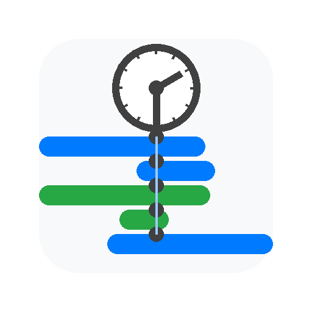

# VOD Synchronizer

<table align="center">
  <tr>
    <td style="">
      
    </td>
    <td style="">
      
SOOP 혹은 CHZZK VOD(다시보기) 시청 시 생방송 보듯이 다른 스트리머의 시점이나 채팅이 궁금할때 다른 스트리머의 VOD를 찾아서 볼 수 있게 해주는 크롬 확장 프로그램입니다.

    </td>
  </tr>
</table>

[주요 기능](#주요-기능) • [설치 방법](#설치-방법) • [사용 예시](#사용-예시) • [지원 플랫폼](#지원-플랫폼) • [QnA](#qna) • [알려진 문제](#알려진-문제) • [업데이트 내역](#업데이트-내역) • [라이선스](#라이선스)

## 주요 기능

### SOOP, CHZZK 다시보기 페이지에서 동작합니다.
- 우측 하단에 영상재생시점기준 당시의 시간을 보여줍니다. 
- 이 시간을 바꿔 입력하면 그 시간에 맞게 VOD의 재생시점을 바꿔서 **재생**합니다.
- 상단 기본 검색창에 스트리머를 검색하면 검색결과에 Sync VOD 버튼이 생기고 버튼을 누르면 해당 스트리머의 VOD에서 현재 재생 시점과 동일한 시점의 VOD를 찾아 새 탭에서 열어줍니다. (최초 실행 시 팝업 허용이 필요할 수 있습니다.)
- 우측 '타 플랫폼과 동기화' 버튼을 클릭하면 SOOP 스트리머를 검색하여 동기화할 수 있습니다.

#### 더 자세한 내용은 [아래 사용 예시](#사용-예시)을 참고하세요.

## 설치 방법

### 방법 1: Chrome Web Store에서 설치 (권장)
1. [Chrome Web Store](https://chromewebstore.google.com/detail/vod-synchronizer/fcgefghffdkgllcmgbckhiebjgcdppme)에서 VOD Synchronizer를 설치하세요.
2. "Chrome에 추가" 버튼을 클릭하여 설치를 완료하세요.

### 방법 2: GitHub Releases에서 다운로드 (개발자용 혹은 스토어에 게시되기전에 미리 체험용)
1. [이 저장소](https://github.com/AINukeHere/VOD-Synchronizer)의 우측에 있는 [Releases](https://github.com/AINukeHere/VOD-Synchronizer/releases)를 클릭합니다.
2. 원하는 버전의 릴리즈 Assets에서 VOD-Synchronizer_로 시작하는 zip파일을 다운로드합니다.
3. 다운로드한 ZIP 파일을 원하는 위치에 압축을 풉니다.
4. 크롬 브라우저에서 확장 프로그램 관리(chrome://extensions)로 이동합니다.
5. 우측 상단의 "개발자 모드"를 활성화합니다.
6. "압축해제된 확장 프로그램을 로드합니다" 버튼을 클릭하고, 압축을 푼 폴더를 선택합니다.

### 방법 3: TamperMonkey를 사용하는 경우 (SOOP 동기화만 지원)
1. [https://greasyfork.org/ko/scripts/541829-vod-synchronizer](https://greasyfork.org/ko/scripts/541829-vod-synchronizer)에서 스크립트를 설치하세요.

## 사용 예시

### SOOP VOD
SOOP VOD 플레이어 페이지에 접속하면 확장 프로그램이 자동으로 활성화됩니다.
####  데모 영상(스토리 담느라 쓸데없이 김)  

### CHZZK VOD
CHZZK VOD 플레이어 페이지에서도 동일하게 동작합니다.
 우측 파란색 버튼을 클릭하여 SOOP 스트리머와 동기화할 수 있습니다. 

####  데모 영상(CHZZK --> SOOP --> SOOP)  

## 지원 플랫폼

### SOOP
- VOD 타임스탬프 표시 및 편집
- 다른 플랫폼 스트리머 VOD 동기화
- RP 닉네임 패널

### CHZZK
- VOD 타임스탬프 표시 및 편집
- 다른 플랫폼 스트리머 VOD 동기화
- RP 닉네임 패널

### 이 프로젝트의 원리에 대해 궁금한 개발자이신가요?
- 로직 구조는 [여기](./doc/communication_flow.md)를 확인해보세요.

## QnA
### 1. 다시보기를 지우거나 해당 시간대의 다시보기가 없으면 어떡해요?
당연히 못 보는거죠 뭐. 없는걸 만들거나 다시보기를 저장해두는 서버가 있는 게  아니라 그냥 사용자 계정으로 대신 검색해주는 기능일 뿐입니다.

### 2. SOOP과 동기화하려고 Sync VOD 버튼을 눌렀는데 실패했다고도 안뜨고 탭도 안 열려요.
주소 표시줄에 팝업 차단 표시가 있나요? 팝업을 허용해주세요.

## 알려진 문제
- CHZZK의 경우 라이브를 34시간을 초과하여 다시보기가 3개 이상으로 쪼개진 경우 타임스탬프가 잘못 계산될 수 있습니다.

## 업데이트 내역
### 1.4.0
- [SOOP 새 기능] 이전 채팅 내역 복원
  - VOD를 재생한 시점의 이전 채팅 내역을 불러올 수 있습니다.
  - 복원 구간을 설정할 수 있습니다. (기본 30초)
  - 복원 버튼에 커서를 올리면 다음 복원 구간이 표시됩니다.
  - 채팅 내 시그니처 이모티콘과 기본 이모티콘, ogq가 지원됩니다.
  - 최대한 데이터를 분석하여 구독 이모티콘, 팬클럽 열혈팬 서포터 뱃지가 알맞게 표시되도록 했지만 제 나름대로 분석한거라 사실과 다를 수 있습니다. 스트리머와 매니저 채팅은 아직 분석하지 않아서 정상적으로 표시되지 않을 것입니다.(닉네임과 채팅은 올바르게 표시됩니다)

 
 

### 1.3.2
- 편의성 개선: 검색창에 동기화 대상 스트리머를 입력하고 Ctrl+Shift+Enter를 누르면 첫 번째 SyncVOD 버튼을 자동으로 클릭합니다.
- 타임스탬프 부분에 커서를 올리면 도움말 툴팁을 띄웁니다.
- 이제 타임스탬프 수정 시 방향키를 눌러도 vod의 앞/뒤로 가기 기능이 동작하지 않습니다.
- 타임스탬프 텍스트를 복사할 때 텍스트데이터만 복사됩니다. (배경,글자 색상 X)
- CHZZK VOD 플레이어에 페이지를 로딩할 때 저장된 설정값이 제대로 적용되지 않는 문제를 해결했습니다.

### 1.3.1
- 이제 `Sync VOD` 버튼을 누르고 동기화 가능한 다시보기가 발견되면 자동으로 검색영역이 닫힙니다.
- CHZZK에서 pip상태가 된 다시보기를 닫았을 때 동기화를 시도할 수 있었던 문제를 수정했습니다.
- VOD가 없는 상태에서 동기화를 시도할 수 있던 문제를 수정했습니다.
- VOD 페이지를 벗어낫음에도 전역동기화 버튼이 남아있던 문제를 수정했습니다.

### 1.3.0
- SOOP --> CHZZK 동기화 기능이 추가되어 플랫폼 간 양방향 동기화가 가능합니다.
- `SOOP과 동기화` 패널과 `CHZZK과 동기화` 패널이 `타 플랫폼과 동기화` 패널로 통합되었습니다.
- 전역 동기화 버튼이 추가되었습니다. 해당 VOD를 기준으로 나머지 열려있는 VOD들을 동기화합니다.
- VOD 페이지를 벗어나는 경우 전역동기화 버튼이 남아있던 문제를 수정했습니다.

- CHZZK과 동기화하는 로직이 개선되어 동기화 시간이 단축되었습니다.
- SOOP의 타임스탬프를 방송시간 외의 시간으로 설정할 수 있던 문제를 수정했습니다.
- 이제 SOOP에서도 vod 플레이어 페이지에서만 패널들이 표시됩니다.

### 1.2.4
- 간혹 스크립트 로드 순서가 꼬여 기능이 동작하지 않던 문제를 수정했습니다.

### 1.2.3
- SOOP의 파생된 VOD(클립, 캐치)에서 타임스탬프를 수정하여 특정시간대로 이동하는 기능이 제대로 동작하지 않던 문제를 수정했습니다.
- 간단한 반복 재생 설정 기능을 추가했습니다. VOD 플레이어의 설정을 누르면 반복 재생 메뉴가 추가됩니다.

- 이제 업데이트 시 1회에 한하여 업데이트 내역을 표시합니다.

### 1.2.2
- 동기화된 SOOP 다시보기가 열리고 재생되는 시간이 조?금 단축되었을 수도 있습니다.
- 편집된 다시보기를 동기화할때 제대로 계산하여 동기화하지 못하던 문제를 수정했습니다.
- 업로드된 VOD에서 동기화를 시도하는 경우 에러가 발생하는 문제를 수정했습니다.

### 1.2.1
- 콘솔창에 에러메시지가 뜨는 문제를 해결했습니다.

### 1.2.0
- SOOP 스트리머와의 동기화 속도가 개선되고 더 이상 여러 탭이 열리지 않고 동기화 가능한 다시보기만 열립니다.
- 이제 SOOP의 클립, 캐치도 연결된 원본 다시보기가 존재한다면 라이브 당시 시간을 표시하고 동기화가 가능합니다. 다만 SOOP 자체의 문제점으로 수초의 오차가 발생할 수 있습니다.
- SOOP에서 표시되는 타임스탬프를 수정하면 더이상 페이지가 새로고침되지 않고 즉시 해당 시점으로 점프합니다.
- 이제 같이보기 등으로 편집된 SOOP 다시보기도 라이브 당시 시간을 정상적으로 표시합니다. (잘 안되면 제보바람)
- CHZZK에서 SOOP 스트리머와 동기화할 때 SOOP 검색을 누르고 난 이후에 치지직 다시보기의 시점을 반영하여 동기화하지 않던 문제를 해결했습니다.
- 버튼 텍스트가 FindVOD에서 SyncVOD로 변경되었습니다.

### 1.1.3
- 1.1.2에서 발생한 설정 저장 오류 문제를 수정했습니다.

### 1.1.2
- 더 이상 사용되지 않는 SOOP 방송국 도메인을 제거했습니다. (ch.sooplive.co.kr)
- 방송국 UI 마이너 업데이트로 인해 동기화가 동작하지 않던 문제를 해결했습니다.
- 이제 SOOP 동기화 시 검색결과에 따라 추가 검색을 시도합니다.

### 1.1.1
- 동기화할 SOOP 다시보기가 없는 경우 스크립트가 멈추는 현상을 수정했습니다.

### 1.1.0
- SOOP 방송국 페이지가 리뉴얼됨에 따라 SOOP 다시보기를 검색하는 로직이 업데이트되었습니다.
- 문의를 위한 1:1오픈채팅방을 개설했습니다. 설정페이지에서 문의하기를 눌러보세요.

### 1.0.1
- 다른 스크립트와 충돌할 가능성이 있는 부분을 수정했습니다.

### 1.0.0
- Chrome 웹 스토어에 게시

### 0.0.9.3
- CHZZK 동기화 기능 개선 및 안정성 향상
- 타임스탬프 툴팁 투명화 기능 개선
- iframe 통신 프로토콜 최적화
- 에러 처리 및 로깅 시스템 개선

### 0.0.9
- CHZZK 동기화를 지원합니다. 다시보기를 시청할때 치지직 기본 검색창에 스트리머를 검색하면 Sync VOD 버튼이 생성됩니다. 누르면 동기화가능한 VOD를 찾습니다. 
**<code>주의사항: chzzk은 다시보기를 기간을 지정하여 검색하는 기능이 없으므로 실제시간과 동기화를 요청한 시간의 차이가 크면 시간이 조금 소요될 수 있습니다. 또한 비공식 치지직 api를 사용하므로 치지직 스트리머와 동기화를 너무 빠르게 시도하는 경우 네이버에서 조치를 취할 수 있습니다.</code>**
- CHZZK VOD 플레이어페이지에서 SOOP 스트리머를 검색하여 동기화할 수 있습니다. 우측 파란 버튼을 눌러 사용할 수 있습니다.
- 키보드 마우스 입력이 2초이상 없거나 마우스가 페이지 밖을 벗어나면 타임스탬프 툴팁이 거의 투명화됩니다.
### 0.0.8
- 최초 배포됨

## 라이선스

이 프로젝트는 MIT 라이선스를 따릅니다. 자세한 내용은 `LICENSE` 파일을 참고하세요. 