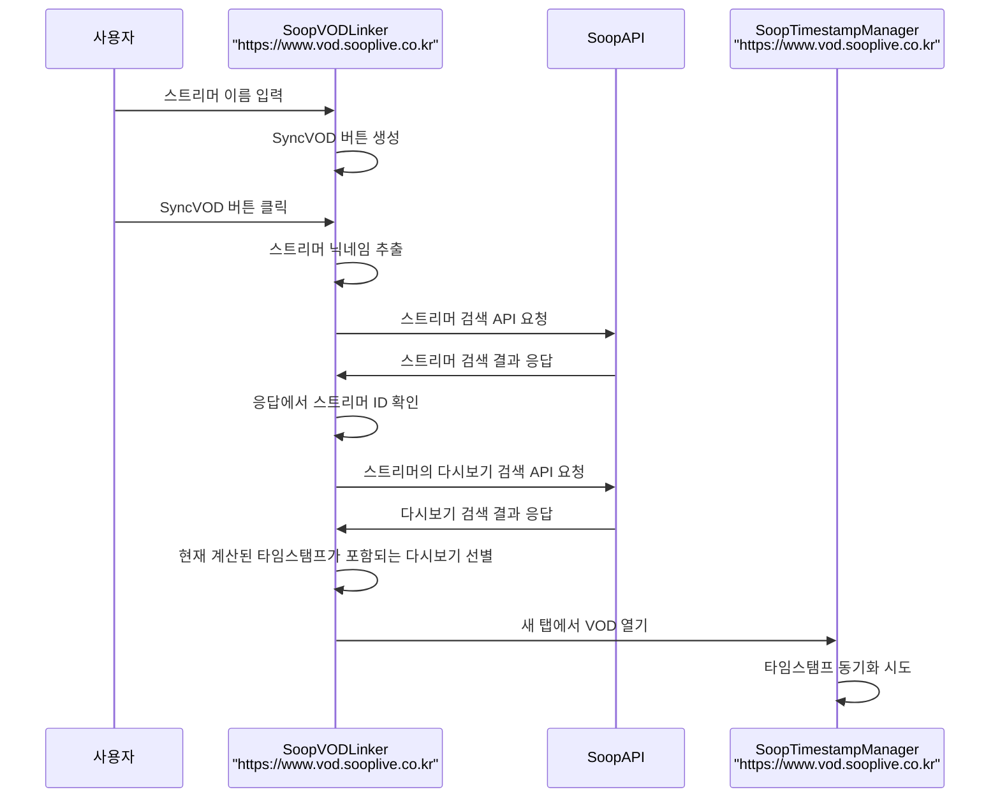
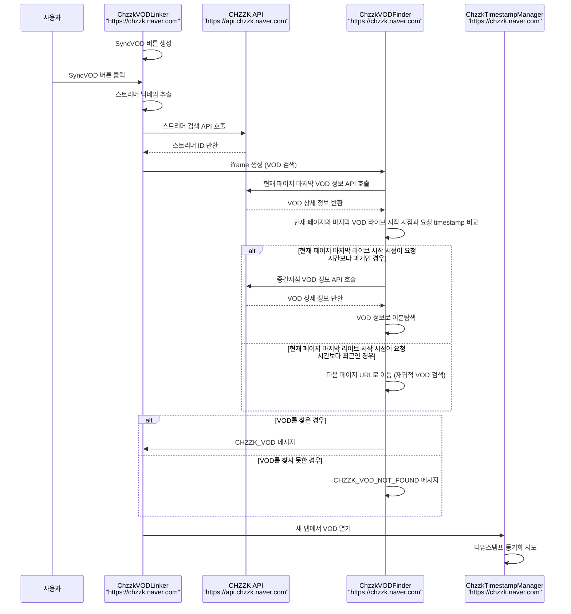
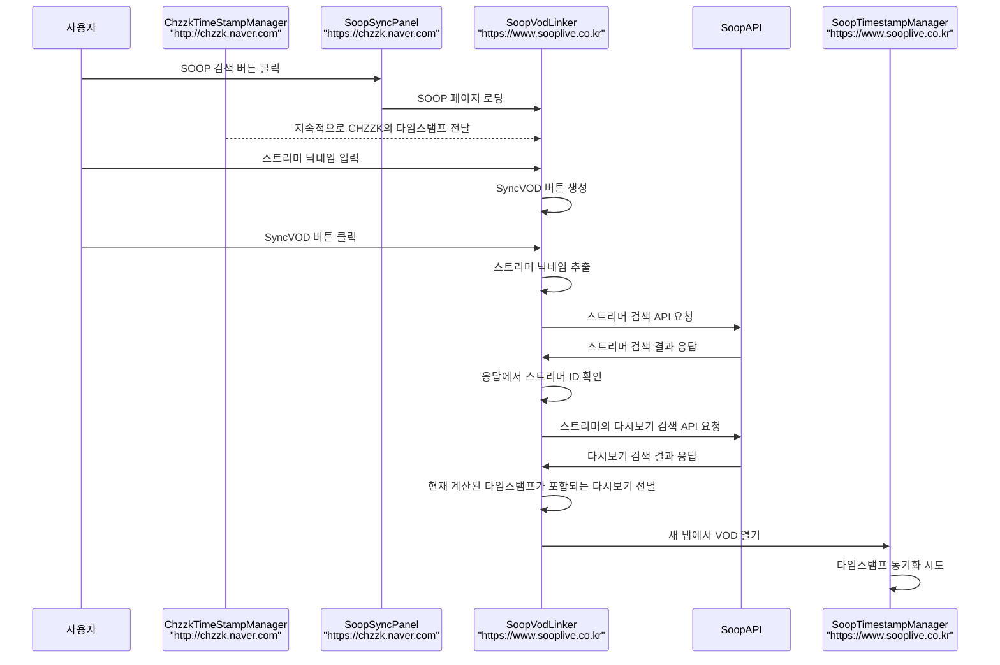

# VOD Synchronizer 통신 흐름

## 1. SOOP 다시보기 → SOOP 스트리머 동기화 흐름

## 2. CHZZK 다시보기 → CHZZK 스트리머 동기화 흐름

## 3. CHZZK 다시보기 → SOOP 스트리머 동기화 흐름

## 4. SOOP 다시보기 → CHZZK 스트리머 동기화 흐름

> **⚠️ 미구현 상태** - 개발 예정인 기능입니다.

 